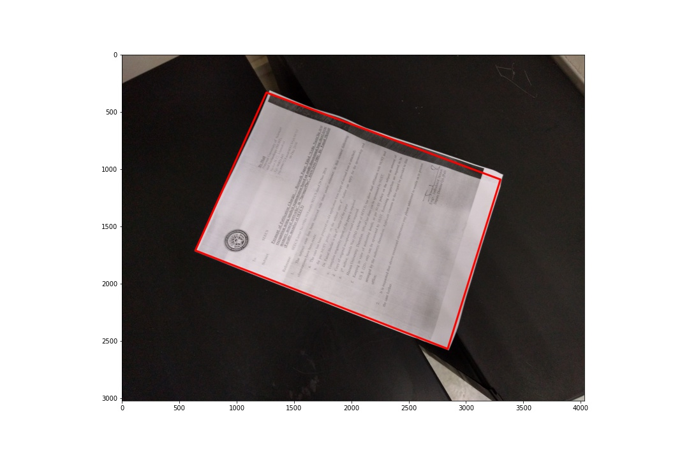

# Распознование листов бумаги на фото

Представлен скрипт для командной строки, а так же [Jupyter Notebook с объяснением](./explanation.ipynb) методов работы данной программы.

На данный момент реализован поиск границ листа с использованием OpenCV, но так же есть идеи как использовать CNN или даже совместить два подхода. Данные идеи будут реализованы в будущем.

### Информация о параметрах для скрипта

Обязательные параметры:
  `image_name`          Файл изображения, на котором необходимо найти края листа

Опциональные параметры:
  `-h`, `--help`          Показать справку по программе
  `--threshold1`          Первый трешхолд для алгоритма Кэнни (по умолчанию: 40)
  `--threshold2`          Второй трешхолд для алгоритма Кэнни (по умолчанию: 100)
  `--blur`                Параметр размытия по Гауссу перед алгоритмом Кэнни (по умолчанию: 11)
  `--scale`               Коэффициент сжатия изображения (по умолчанию: 10)
  `--take`                Количество границ, которые берутся для обработки (по умолчанию: 10)
  `--dist`                Расстояние на котором точки границы считаются не различимыми (по умолчанию: 5)
  `--optimize`            Использовать дополнительную эвристику для поиска точек (по умолчанию: True)
  `--dont_show_edges`     Показать все найденные границы на изображении (по умолчанию: False)
  `--show_result`         Не показывать результат (по умолчанию: True)
  `--save_name`           Имя файла для сохранения результата (по умолчанию: None)

Так же ее можно найти вызвав `python main.py --help`

### Пример

Исходное изображение

Изображение с найденными на нем границами

